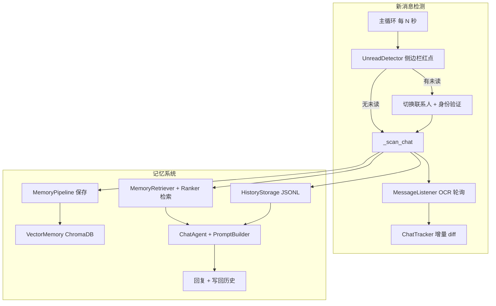
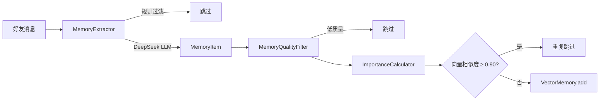

# WeChat-AI-Agent 项目分析：新消息检测与记忆模块

> 本文档用于新对话快速了解项目核心模块。项目路径：`WeChat-AI-Agent/`
>
> 最后更新：2026-07-10

---

## 一、整体架构

这是一个基于 **截图 + OCR + 模拟键鼠** 的微信自动化 Agent，不依赖微信协议。核心编排都在 `system/runner.py` 的主循环里。



### 项目目录速览

```
WeChat-AI-Agent/
├── main.py                          # 入口: AgentRunner(auto_send, interval)
├── system/runner.py                 # 主循环编排（核心）
├── listener/                        # 消息监听 & 增量检测
│   ├── message_listener.py          # OCR 轮询
│   ├── chat_tracker.py              # 按好友游标增量 diff（核心）
│   └── deduplicator.py              # 全局去重缓存
├── wechat/                          # 窗口、截图、OCR、未读检测
│   └── unread_detector.py           # 侧边栏红点检测
├── parser/                          # 气泡 OCR → Message
├── agent/                           # LLM 决策、Prompt 组装
├── llm/                             # 多任务 LLM 客户端（chat/memory/profile）
├── personal/                        # 个人语言风格学习
├── memory/                          # 长期向量记忆、画像、提取
├── history/                         # JSONL 聊天历史
├── context/                         # 好友身份 & 隔离守卫
└── storage/                         # 所有持久化数据
```

---

## 二、新消息检测模块（重点）

检测分 **两层**：先找「谁有未读」，再在聊天区识别「具体新内容」。

### 2.1 第一层：侧边栏未读发现

**核心文件：** `wechat/unread_detector.py`

**流程：**

1. 截取 `SIDEBAR_REGION`（见 `config/settings.py`）
2. 在头像区域（x: 0–70）扫描红色像素（R>150, G<100, B<100）
3. `ContactList.scan()` OCR 联系人列表
4. 用行边界法把红点 Y 坐标匹配到联系人

**输出格式：**

```python
[{"name": "李四", "unread_count": 1, "y": 256, "preview": "..."}, ...]
```

**主循环策略**（`system/runner.py`）：

- 有未读 → `_handle_unread()`：切换联系人 → 身份验证 → `_scan_chat()`
- 无未读 → 直接 `_scan_chat()` 监控当前窗口
- 同一联系人 **8 秒冷却**（`_UNREAD_COOLDOWN_SEC`），避免红点未消失时重复处理

**相关文件：**

| 文件 | 作用 |
|------|------|
| `wechat/unread_detector.py` | 红点像素检测 + 联系人匹配 |
| `wechat/contact_list.py` | OCR 侧边栏联系人 |
| `wechat/contact_switcher.py` | 点击切换聊天 |
| `wechat/identity_verifier.py` | 验证标题栏是否为预期联系人 |
| `listener/sidebar_monitor.py` | 旧版方案，**未接入主循环** |

---

### 2.2 第二层：聊天区内容增量识别

**核心文件：** `listener/message_listener.py` + `listener/chat_tracker.py`

#### MessageListener：OCR 采集

单次轮询 `_poll()` 流程：

```
激活窗口 → 标题栏 OCR（识别聊天对象）
         → 聊天区截图 → RapidOCR（含坐标）
         → BubbleParser（气泡颜色/位置 → friend/me）
         → sender 映射为真实姓名
```

`poll_new_messages(friend_id)` 返回 `(all_messages, new_messages)`，其中 new 由 ChatTracker.diff 决定。

#### ChatTracker：增量 diff（核心设计）

每个好友独立维护状态，持久化到 `storage/chat_tracker.json`：

| 字段 | 作用 |
|------|------|
| `seen` | 已见消息指纹列表 |
| `seen_contents` | 已见正文（OCR 碎片去重用） |
| `last_replied` | 已回复过的 friend 消息指纹 |
| `initialized` | 是否完成首次快照 |

**指纹算法**（ deliberately 不用 Y 坐标）：

```python
# sender + MD5(normalized_content)[:12]
fingerprint = f"{sender}_{content_hash}"
```

**关键行为：**

1. **首次快照不回复**：第一次打开某好友聊天，只记录当前屏幕消息，返回空列表，避免对历史消息自动回复
2. **OCR 碎片过滤**：新内容是已见内容的子串时跳过（滚动/截断导致 OCR 变短）
3. **连发合并**：多条未回复 friend 消息合并成一条再回复一次
4. **防重复回复**：`last_replied` + 「最后一条是自己发的且已全部标记已回复」则跳过

**可调常量：**

| 常量 | 值 | 含义 |
|------|-----|------|
| `MAX_SEEN_PER_FRIEND` | 500 | 每好友最大指纹数 |
| `TRACKER_VERSION` | 2 | 旧版 Y 坐标指纹会触发重置 |

#### AgentRunner 中的完整检测链路（`_scan_chat`）

```
1. IdentityResolver 解析好友身份 → friend_id
2. MessageListener.poll_new_messages(friend_id)
3. 筛出 friend 新消息 → 去掉已回复 (get_unreplied_friend_msgs)
4. 检查最后一条是否为自己 + 是否已全部回复
5. merge_contents 合并多条 → batch_msg
6. 加载历史/记忆 → Agent 生成回复
7. mark_replied + _after_reply 收尾
```

---

### 2.3 第三层：MessageDeduplicator（辅助去重）

**文件：** `listener/deduplicator.py`

- 全局 `sender + content` 精确匹配
- 持久化到 `storage/message_cache.json`
- 主流程里 **ChatTracker 负责实时增量检测**，Deduplicator 在回复后做 bookkeeping
- 注意：`SIMILARITY_THRESHOLD = 1.0`，模糊匹配实际等于关闭，只做精确去重

---

### 2.4 两套去重机制对比

| 维度 | ChatTracker | MessageDeduplicator |
|------|-------------|-------------------|
| 粒度 | 按好友隔离 | 全局 |
| 标识 | `sender + MD5(content)[:12]` | `sender + content` 全文 |
| 用途 | 实时增量检测 | 回复后标记已处理 |
| 持久化 | `chat_tracker.json` | `message_cache.json` |

---

### 2.5 已知痛点

`storage/messages.json` 和 `chat_tracker.json` 里大量出现 **「以下是新消息」** 前缀，说明：

- 微信 UI 的「以下是新消息」分隔线被 OCR 当成消息内容
- `BubbleParser` / `parser/system_filter.py` 尚未完全过滤这类系统标记
- 会污染指纹、记忆提取和 Prompt 上下文

**建议修复位置：** `parser/system_filter.py` 或 `BubbleParser` 层统一清洗。

---

## 三、记忆模块（重点）

记忆是 **多层存储 + 流水线处理**，不是单一数据库。

### 3.1 记忆分层架构

| 层级 | 存储 | 模块 | 用途 |
|------|------|------|------|
| 短期上下文 | RAM | `agent/context.py` | 当前会话最近 20 条（兜底） |
| 对话历史 | `storage/history/{friend_id}.jsonl` | `history/storage.py` | Prompt 上下文（**优先级最高**） |
| 长期语义记忆 | ChromaDB `storage/vector_db/chroma/` | `memory/vector_memory.py` | 事实/偏好/事件检索 |
| 好友画像 | `storage/profiles/{friend_id}.json` | `memory/profile_builder.py` | LLM 总结的兴趣/性格/雷点/说话样例 |
| 个人语言风格 | `storage/personal/my_style.json` | `personal/style_analyzer.py` | 从全部 history 提取 `sender=me` 并 LLM 分析 |
| 好友元数据 | `storage/friends.json` | `memory/friend.py` | 关系、标签、手动 notes |
| 用户身份/风格 | `profile.json` / `style.json` | `memory/profile.py` / `style.py` | 角色设定（手动）+ 风格约束（手动） |
| 扁平日志 | `storage/messages.json` | `memory/memory_manager.py` | 全量消息记录（不直接进 Prompt） |

**好友隔离：** 每个 `friend_id` 独立 ChromaDB Collection（`friend_{id}`）、独立 JSONL、独立 profile。

---

### 3.2 记忆保存流水线

**核心：** `memory/memory_pipeline.py`



#### Step 1：MemoryExtractor（`memory/extractor.py`）

**规则层（不调 LLM）：**

- 长度 < 5 字符
- 语气词（哈哈、好的、在吗…）
- 纯数字/符号
- 自己的消息不记忆

**LLM 层（`LLMClient`, task=memory）：**

- 判断 `need_memory`
- 分类：`fact / preference / event / relationship`
- 第三人称总结 + importance 0–1

#### Step 2：MemoryQualityFilter（`memory/quality_filter.py`）

- 过滤垃圾、系统工具类内容（百度网盘、转账等）
- 关键词重分类（identity / goal / emotion / habit…）
- 情绪类降权（如「我是废物」→ importance 0.20）

#### Step 3：VectorMemory（`memory/vector_memory.py`）

- ChromaDB 持久化
- ONNX 嵌入（`BAAI/bge-small-zh-v1.5`，512 维，via `memory/embedding.py`）
- 语义搜索，距离转相似度 `score = 1.0 - dist/2`
- 中文 friend_id 会 hash 成 ASCII 安全的 collection 名

#### Step 4：去重

- 保存前向量搜索，相似度 ≥ **0.90** 视为重复（`DUPLICATE_THRESHOLD`）

**相关模块（已定义但部分未完全接入）：**

| 模块 | 文件 | 状态 |
|------|------|------|
| 重要性计算 | `memory/importance.py` | 已接入 Pipeline |
| 时间衰减 | `memory/decay.py` | 已定义，Ranker 未使用 |
| 画像构建 | `memory/profile_builder.py` | 从 history + 向量记忆 LLM 更新，启动时/增量自动触发 |

---

### 3.3 记忆检索与排序

**检索：** `memory/retriever.py` → `VectorMemory.search(query, limit=10)`

**排序过滤：** `memory/ranker.py`

```
final_score = similarity×0.6 + importance×0.2 + recency×0.2
```

- 最低分 **0.55**（`MIN_SCORE`）
- 最多返回 **3 条**（`MAX_RESULTS`）
- 短消息/语气词查询直接返回空

**时间衰减（recency）：**

| 天数 | recency |
|------|---------|
| ≤30 | 1.0 |
| ≤90 | 0.7 |
| ≤180 | 0.4 |
| >180 | 0.2 |

---

### 3.4 记忆如何进入 Prompt

**PromptBuilder**（`agent/prompt.py`）组装顺序：

1. **好友身份卡**（`StyleContextBuilder` → summary / 背景 / 雷点 / 聊天注意）
2. 角色设定（`profile.json`）
3. **我的聊天风格**（`PersonalStyle` → `storage/personal/my_style.json`）
4. **我的说话样例** + **对方说话样例**（history + 画像 voice_samples）
5. 手动风格约束（`style.json`，可选）
6. **长期记忆**（Ranker 结果 →「你对 TA 的了解」）
7. **对话上下文**（优先级：JSONL 历史 > OCR 屏幕 > Agent 内存）
8. 对方最新消息 → 要求生成回复

**StyleContextBuilder**（`memory/style_context.py`）负责组装好友身份卡与双方 voice samples，供 Prompt 注入。

**上下文优先级：**

1. `history_context`（JSONL，最多 20 条）— 最高
2. `screen_messages`（OCR 可见聊天）— JSONL 为空时兜底
3. `context`（ConversationContext 内存）— 最后兜底

调试输出：`debug/last_prompt.txt`

---

### 3.5 MemoryManager 的角色

`memory/memory_manager.py` 是 **门面类**，统一管理：

- 用户画像 / 聊天风格
- 好友元数据（`friends.json`）
- 扁平消息日志（`messages.json`）

向量记忆 **不在 MemoryManager 里**，由 `MemoryPipeline` / `MemoryRetriever` 独立管理。

---

### 3.6 离线历史导入

`history/initializer.py` + `tools/history_collector.py`：

- 滚动采集聊天 → 写入 JSONL
- `HistoryAnalyzer` 批量 LLM 分析 → 写入向量库
- `ProfileBuilder` 更新画像

适合冷启动，给新好友补全长期记忆。

---

## 四、两模块协作（端到端）

```
每 2 秒主循环（main.py --interval N）
    │
    ├─ UnreadDetector → 发现未读联系人
    │       └─ 切换 + 验证身份
    │
    └─ _scan_chat()
            │
            ├─ [检测] MessageListener._poll() → OCR 解析
            ├─ [检测] ChatTracker.diff() → 增量新消息
            ├─ [检测] 合并连发 + 防重复回复
            │
            ├─ [记忆·存] MemoryPipeline.process() × N 条
            ├─ [记忆·取] MemoryRetriever + MemoryRanker
            ├─ [记忆·取] HistoryStorage.get_recent(20)
            ├─ [记忆·取] StyleContextBuilder → 好友身份卡 + voice samples
            ├─ [记忆·取] PersonalStyle → my_style.json
            │
            ├─ ChatAgent.process_message() → LLMClient(task=chat)
            │
            └─ [记忆·写回] HistoryStorage.save() + messages.json
                           ChatTracker.mark_replied()
                           MessageDeduplicator.add()
```

---

## 五、关键配置与持久化文件

### 运行时参数（`main.py`）

| 参数 | 默认 | 说明 |
|------|------|------|
| `--interval N` | 2.0s | 主循环轮询间隔 |
| `--no-send` | off | 只生成回复不发送 |

### 区域配置（`config/settings.py` + `config/chat_region.json`）

| 配置 | 用途 |
|------|------|
| `CHAT_REGION` | 聊天气泡截图区 |
| `TITLE_REGION` | 标题栏 OCR |
| `SIDEBAR_REGION` | 侧边栏红点检测 |
| `INPUT_REGION` | 消息输入框 |

### LLM 配置（`.env`）

多任务路由（`llm/client.py` + `llm/config.py`）：

| 任务 | 环境变量 | 推荐 Provider | 用途 |
|------|----------|---------------|------|
| chat | `LLM_CHAT_PROVIDER` / `LLM_CHAT_API_KEY` | qwen (qwen-plus) | 拟人化微信回复 |
| memory | `LLM_MEMORY_PROVIDER` / `LLM_MEMORY_API_KEY` | deepseek | 长期记忆提取 |
| profile | `LLM_PROFILE_PROVIDER` / `LLM_PROFILE_API_KEY` | deepseek | 好友画像 JSON 更新 |

详见 `.env.example`。三任务也可共用同一 Provider（`LLM_PROVIDER` + `LLM_API_KEY`）。

### 持久化文件

| 路径 | 内容 |
|------|------|
| `storage/chat_tracker.json` | 每好友 seen / last_replied 游标 |
| `storage/message_cache.json` | 全局已处理消息 |
| `storage/history/{friend_id}.jsonl` | 完整对话 JSONL |
| `storage/vector_db/chroma/` | ChromaDB 向量库 |
| `storage/profiles/{friend_id}.json` | 好友详细画像 |
| `storage/personal/my_style.json` | 自动学习的个人语言风格 |
| `storage/friends.json` | 好友元数据 |
| `storage/messages.json` | 扁平消息日志 |
| `storage/profile.json` | 用户身份 |
| `storage/style.json` | 聊天风格 |

---

## 六、设计亮点与改进空间

### 亮点

1. **ChatTracker 指纹不用 Y 坐标**，避免发送后滚动导致重复触发
2. **首次快照机制**，切换聊天不会误回历史消息
3. **OCR 碎片子串过滤**，针对截断问题有专门处理
4. **记忆分层清晰**：JSONL 管近期对话，向量库管长期事实，画像管人格特征
5. **好友级隔离**，ChromaDB 按人分 Collection

### 可改进点

1. **「以下是新消息」过滤**：应在 `parser/system_filter.py` 或 `BubbleParser` 层统一清洗
2. **双去重系统职责重叠**：ChatTracker 与 MessageDeduplicator 可进一步收敛
3. **每条消息新建 MemoryPipeline**：`runner.py` 循环内重复实例化，可缓存 per-friend pipeline
4. **MemoryDecay 未接入 Ranker**：`decay.py` 已定义但未在排序中使用
5. **Deduplicator 模糊匹配名存实亡**：`SIMILARITY_THRESHOLD=1.0` 等于只做精确匹配

---

## 七、新好友自动建档（2026-07-09 新增）

记忆库中**不存在**的好友首次发消息时，系统自动：

1. **中文名 → 拼音 friend_id**（`context/name_mapper.py` + `pypinyin`）
2. **持久化映射** → `storage/name_map.json`
3. **写入 friends.json**（含 `friend_id` 字段）
4. **初始化空画像** → `storage/profiles/{friend_id}.json`
5. **消息存入 JSONL** → `storage/history/{friend_id}.jsonl`

**核心模块：**

| 模块 | 文件 | 作用 |
|------|------|------|
| 名字映射 | `context/name_mapper.py` | 中文名转拼音 ID，处理重名后缀 |
| 好友注册 | `memory/friend_registry.py` | `ensure_friend()` 一站式建档 |
| 主循环接入 | `system/runner.py` | 收到消息前调用建档 |

**示例映射：**

```
杨春辉 → yangchunhui
张玉萍 → zhangyvping
铁三鱼(3) → tiesanyu3
埋索 → maisuo
```

**依赖：** `pip install pypinyin`（已加入 `requirements.txt`）

### 第一阶段改造（2026-07-10 已完成）

| 改造项 | 模块 | 说明 |
|--------|------|------|
| 系统消息过滤 | `memory/content_filter.py` | 过滤「以下是新消息」等 OCR 噪音 |
| Decay 接入 | `memory/ranker.py` + `memory_pipeline.py` | metadata 写入 expire_days，Ranker 使用 MemoryDecay |
| 异步提取 | `memory/memory_service.py` | Pipeline 缓存 + 后台 ThreadPool 提取 |
| 画像自动更新 | `memory_service._maybe_update_profile()` | 保存记忆后满足条件自动 update_profile |
| 主流程 | `system/runner.py` | 回复前同步检索，回复后异步提取 |

### 第二阶段改造（2026-07-10 已完成）

| 改造项 | 模块 | 说明 |
|--------|------|------|
| 中文 Embedding | `memory/embedding.py` | fastembed + `BAAI/bge-small-zh-v1.5`（512维），失败回退 MiniLM |
| 记忆合并/矛盾 | `memory/memory_merger.py` | 0.75–0.90 强化/supersede，≥0.90 跳过 |
| 向量更新/删除 | `memory/vector_memory.py` | `update()` / `delete()` 支持 supersede |
| 回忆型检索 | `memory/ranker.py` | 「你知道/记得吗」等绕过短句过滤，最多 5 条 |
| 数据迁移 | `tools/migrate_friend_ids.py` | 中文 history/profile/chroma → 拼音 friend_id |

**Embedding 迁移注意：** 维度 384→512，旧向量库需重新嵌入或运行迁移后清空重建。安装依赖：`pip install fastembed chromadb`

**数据迁移用法：**
```bash
python tools/migrate_friend_ids.py --dry-run   # 预览
python tools/migrate_friend_ids.py --apply     # 执行
```

### 第三阶段改造（2026-07-10 已完成）

| 改造项 | 模块 | 说明 |
|--------|------|------|
| 统一存储层 | `memory/memory_store.py` | chat/vector/profile/meta/audit 分层门面 |
| ContextGuard | `context/context_guard.py` + `memory_service.py` | bind_friend 会话绑定 + 读写校验 |
| 记忆管理 CLI | `tools/memory_admin.py` | 查看/搜索/删除记忆与历史 |
| 主流程 | `system/runner.py` | 经 MemoryStore 读写，audit 日志与 Prompt 分离 |

**记忆管理 CLI：**
```bash
python tools/memory_admin.py list-friends
python tools/memory_admin.py show yangchunhui
python tools/memory_admin.py list-memories yangchunhui
python tools/memory_admin.py search yangchunhui "喜欢什么"
python tools/memory_admin.py delete yangchunhui <mem_id>
python tools/memory_admin.py history yangchunhui --limit 20
```

### 第四阶段改造（2026-07-10 已完成）

| 改造项 | 模块 | 说明 |
|--------|------|------|
| 多模型 LLM | `llm/client.py` + `llm/config.py` | chat / memory / profile 分任务路由到不同 Provider |
| 个人风格学习 | `personal/` | 从全部 `storage/history/*.jsonl` 提取 `sender=me`，LLM 分析 → `storage/personal/my_style.json` |
| 好友历史读取 | `memory/friend_history_reader.py` | 从单个 jsonl 提取 `sender=friend`，去重 + OCR 噪音过滤 |
| 详细好友画像 | `memory/profile.py` + `profile_builder.py` | 新增 summary / background / dislikes / how_to_talk / voice_samples 等字段 |
| 风格上下文 | `memory/style_context.py` | 好友身份卡 + 双方说话样例，注入 Prompt |
| 启动同步 | `system/runner.py` | 启动时 sync 个人风格 + `sync_all_friend_profiles()` |
| 批量更新 | `memory/batch_update_profiles.py` | 强制从 history 重新生成所有好友画像 |

**个人风格学习用法：**
```python
from personal.style_analyzer import StyleAnalyzer

analyzer = StyleAnalyzer()
style = analyzer.sync_from_storage(force=True)   # 从全部 history 重建
# 结果 → storage/personal/my_style.json
```

**好友画像更新用法：**
```python
from memory.profile_builder import ProfileBuilder

pb = ProfileBuilder("yangchunhui", "杨春辉")
profile = pb.sync_from_storage(force=True)
# 结果 → storage/profiles/yangchunhui.json
```

**批量更新所有画像：**
```bash
python -m memory.batch_update_profiles
```

**FriendProfile 主要字段：**

| 字段 | 说明 |
|------|------|
| `summary` | 一句话整体印象 |
| `background` / `current_status` | 背景与近况 |
| `interests` / `personality` | 兴趣与性格（最多 8 项） |
| `dislikes` | 雷点（如「哈哈」「人机感」） |
| `how_to_talk` | 和 TA 聊天注意事项 |
| `relationship_notes` | 关系细节 |
| `voice_samples` | 对方真实说话样例（最多 8 条） |
| `key_facts` | 关键事实 |

**画像更新触发条件**（`ProfileBuilder.should_update`）：

- 画像为空 + history ≥ 10 或 memory ≥ 3 → 立即更新
- history 新增 ≥ 10 条 → 更新（间隔 ≥ 1h）
- 向量记忆新增 ≥ 2 条 → 更新（间隔 ≥ 6h）
- 启动时 `sync_all_friend_profiles(force=False)` 批量检查

**PersonalStyle 主要字段：**

| 字段 | 说明 |
|------|------|
| `tone` | 语气特征（如「随意」「简短」） |
| `sentence_length` | 句长偏好 |
| `common_words` / `avoid_words` | 常用词 / 避免词 |
| `emoji_usage` | 表情使用习惯 |
| `examples` | 代表性发言样例 |
| `message_count` | 参与分析的 me 消息数 |

---

## 八、核心源码索引

| 模块 | 关键入口 |
|------|----------|
| 主循环 | `system/runner.py` → `AgentRunner._run_loop()` / `_scan_chat()` |
| 未读检测 | `wechat/unread_detector.py` → `detect_unread()` |
| 新好友建档 | `memory/friend_registry.py` → `ensure_friend()` |
| 名字映射 | `context/name_mapper.py` → `resolve_or_create()` |
| OCR 轮询 | `listener/message_listener.py` → `poll_messages()` / `diff_messages()` |
| 增量 diff | `listener/chat_tracker.py` → `diff()` |
| 记忆保存 | `memory/memory_pipeline.py` → `process()` |
| 记忆服务 | `memory/memory_service.py` → `retrieve_and_rank()` / `sync_all_friend_profiles()` |
| 风格上下文 | `memory/style_context.py` → `StyleContextBuilder.build()` |
| 好友历史读取 | `memory/friend_history_reader.py` → `collect()` |
| 画像构建 | `memory/profile_builder.py` → `sync_from_storage()` |
| 批量画像更新 | `memory/batch_update_profiles.py` |
| 个人风格 | `personal/style_analyzer.py` → `sync_from_storage()` |
| 个人历史读取 | `personal/history_reader.py` → `collect_all_me_messages()` |
| 多任务 LLM | `llm/client.py` → `LLMClient.chat(task=...)` |
| 统一存储 | `memory/memory_store.py` → `get_chat_history()` / `list_memories()` |
| 上下文守卫 | `context/context_guard.py` → `verify_session()` |
| 记忆管理 CLI | `tools/memory_admin.py` |
| 记忆合并 | `memory/memory_merger.py` → `find_action()` |
| 内容过滤 | `memory/content_filter.py` → `clean_for_memory()` |
| 中文嵌入 | `memory/embedding.py` → `encode()` |
| 数据迁移 | `tools/migrate_friend_ids.py` |
| 记忆检索 | `memory/retriever.py` + `memory/ranker.py` |
| Prompt 组装 | `agent/prompt.py` → `PromptBuilder.build()` |
| 历史读写 | `history/storage.py` → `get_recent()` / `save()` |

---

## 九、新对话快速引用

开启新对话时，可将以下内容粘贴给 AI：

```
请先阅读项目文档：
WeChat-AI-Agent/docs/新消息检测与记忆模块分析.md

然后帮我 [你的具体任务]
```

或让 AI 直接 `@新消息检测与记忆模块分析.md` 引用该文件。
